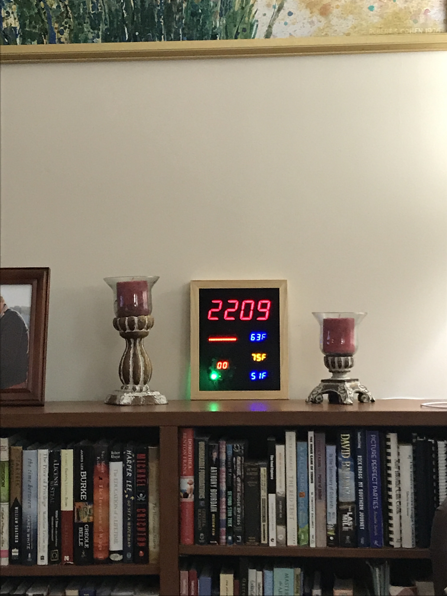
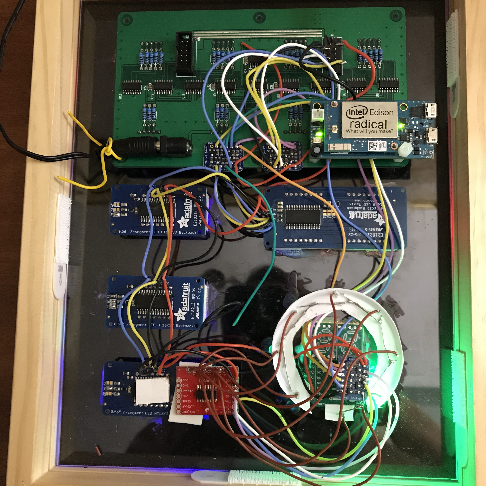

<link rel="stylesheet" href="https://github.com/markdowncss/modest/blob/master/css/air.css"></link>  
  
# 7-Segment LED Clock and Weather Display  
  
  
## Programmed with  
  
  
  
  
## Materials  
8" x 10" Frame  
Smoke Plexiglass  
[Intel Edison Compute Module](datasheets/Intel-Edison-Compute-Module.pdf)  
[Intel Mini-Breakout Board](datasheets/Intel-Edison-Mini-Breakout.pdf)  
[2 - Adafruit Blue 0.56" HT16K33 4-digit 7-segment displays](https://www.adafruit.com/product/881)  
[Adafruit Yellow 0.56" HT16K33 4-digit 7-segment display](https://www.adafruit.com/product/879)  
[Adafruit Red 1.2" HT16K33 8x16 matrix display](https://www.adafruit.com/product/2037)  
[MikroElektronika 7-segment display](https://shop.mikroe.com/click/display/7seg)  
[8 - Super Bright Green 5mm LEDs](https://www.adafruit.com/product/300)  
[Sure Electronics DE-DP002 1.8" Red 7-segment display](http://www.ebay.com/itm/160882858719)  
[Adafruit HT16K33 I2C Backpack Datasheet](datasheets/adafruitHT16K33backpack.pdf)  
[Adafruit 4-ch Logic Level Converter (BSS138 FETs w/ 10K pullups](https://www.adafruit.com/products/757)  
[BSS138 FET Datasheet](datasheets/BSS138.pdf)  
[Adafruit 12 VDC 1000mA regulated switching power adapter - UL listed](https://www.adafruit.com/product/798)  
  
## Required node.js modules  
+ [johnny-five](https://github.com/rwaldron/johnny-five)  
+ [edison-io plug-in](https://github.com/rwaldron/edison-io)  
+ [moment clock handler](https://www.npmjs.com/package/moment)  
+ [wunderground-api for Weather Underground](https://www.npmjs.com/package/wunderground-api)  
+ [scribe - web based console logging](https://www.npmjs.com/package/scribe)  
+ [Express - web based console logging](https://www.npmjs.com/package/express)  
  
## Components  
| Pin  |      Pin       |Function and Component   |  
| ---- | -------------- | ----------------------- |  
|J19-3 |GND             |                         |  
|J17-4 |VIN 7-15vdc     |                         |  
|J20-2 |V-V3P30 3.3v DC |                         |  
|J19-2 |V-V1P80 1.8v DC |                         |  
|J18-2 |GP165           |DATA Time Display        |  
|J20-7 |GP15            |CLOCK                    |  
|J17-1 |GP182_PWM2      |DIMM                     |  
|J18-1 |GP77            |DATA  Wind Speed Display |   
|J18-7 |GP82            |CLOCK Wind Direction LEDs|  
|J18-8 |GP83            |LATCH                    |  
|J17-5 |GP135           |RESET                    |  
|J17-6 |I2C1-SCL        |I2C Bus                  |  
|J17-8 |I2C1-SDA        |                         |  
|      |                |Current Temp Blue 4-Digit|  
|      |                |High Temp Yel 4-Digit    |  
|	   |				|Low Temp Blue 4-Digit    |  
|      |                |Conditions Red Matrix    |  
  
Wiring Diagram [PDF](doc/wiring-diagram.pdf)  
  
  
  
## Useful links  
[Intel Edison Wiki](https://github.com/bethanysciences/Intel-Edison/wiki/setup)  
[Weather Underground Developer API](https://www.wunderground.com/weather/api)  
[Weather Underground Glossary of response variables](https://www.wunderground.com/weather/api/d/docs?d=resources/phrase-glossary)  
[Google sheet for bitbashing matrix icon constructors](https://docs.google.com/spreadsheets/d/1ryyZppKrLKardIMBLBvaaxQxgc5UoEJT8unGqhxCk_o/pubhtml)  
