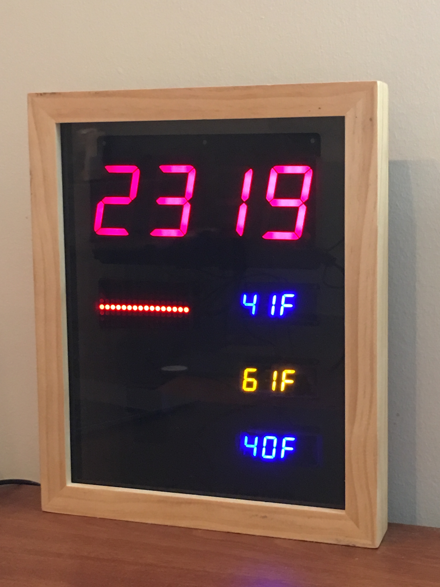
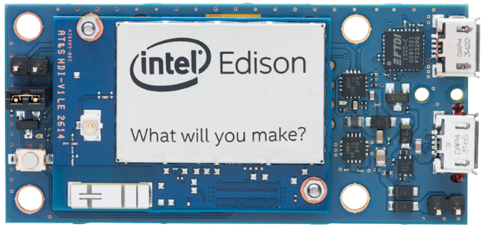
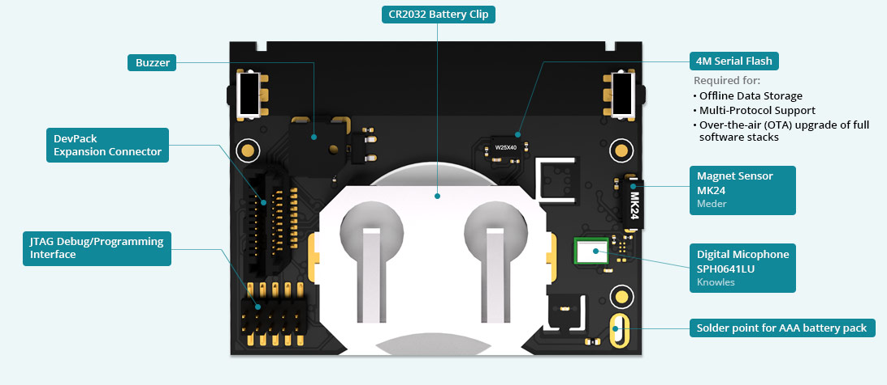
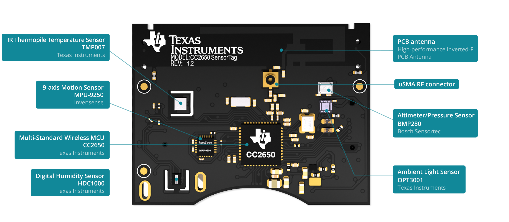
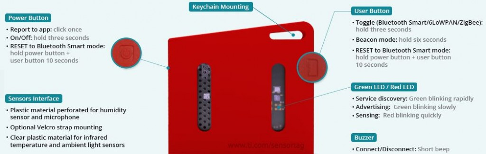
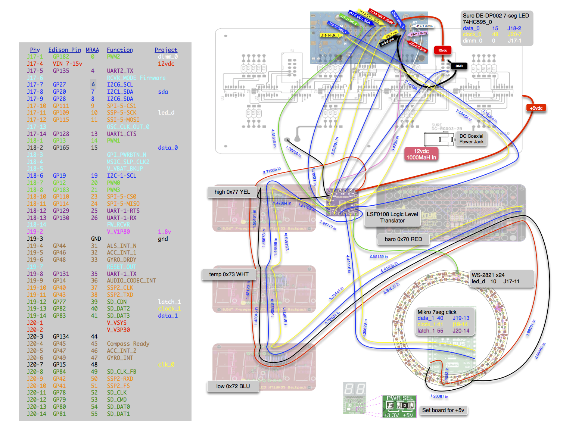

<link rel="stylesheet" href="https://github.com/markdowncss/modest/blob/master/css/air.css"></link>  
# 7-Segment LED Clock and Weather Display  
  
  
## Programmed with  
  
  
  
  
## Hardware  
[Intel Edison Compute Module](datasheets/Intel-Edison-Compute-Module.pdf)  
  
[Intel Mini-Breakout Board](datasheets/Intel-Edison-Mini-Breakout.pdf)    

[Texas Instruments SensorTag](http://www.ti.com/ww/en/wireless_connectivity/sensortag2015/?INTC=SensorTag&HQS=sensortag)  
  
  
  
  
## Required node.js modules  
+ [johnny-five](https://github.com/rwaldron/johnny-five)  
+ [edison-io plug-in](https://github.com/rwaldron/edison-io)  
+ [moment clock handler](https://www.npmjs.com/package/moment)  
+ [wunderground-api for Weather Underground](https://www.npmjs.com/package/wunderground-api)  
  
## Components
|Type |Funct   |Pin             |Function  |Component|  
| --- | ------ | -------------- | -------- | ------- |  
|Power|GND     |J19-3           |          |         |  
|     |VIN     |J17-4           |7-15vdc   |         |  
|     |3.3v    |J20-2 V_V3P30   |          |         |  
|     |1.8v    |J19-2 V_V1P80   |          |         |  
|I2C  |I2C1_SCL|J17-6           |Curr Temp |[Blu 0.56" HT16K33 4-Dig 7-Seg Disp](https://www.adafruit.com/product/881)|  
|     |I2C1_SDA|J17-8           |High Temp |[Yel 0.56" HT16K33 4-Dig 7-Seg Disp](https://www.adafruit.com/product/879)|  
|     |        |                |Low Temp  |[Blu 0.56" HT16K33 4-Dig 7-Seg Disp](https://www.adafruit.com/product/881)|  
|     |        |                |Cond Disp |[Red 1.2" HT16K33 8x16 Matrix Disp](https://www.adafruit.com/product/2037)|  
|     |        |                |Wind Dir  |[Super Bright Green 5mm LED x16](https://www.adafruit.com/product/300)    |  
|GPIO |DATA    |J18-2 GP165     |Clock Disp|[Sure Electronics DE-DP002](http://www.ebay.com/itm/160882858719)         |  
|     |CLOCK   |J20-7 GP15      |          |[Datasheet](datasheets/Sure Display DE-DP002.pdf)                                                                          |  
|     |DIMM    |J17-1 GP182_PWM2|          |                                                                          |  
|GPIO |DATA    |J19-13 GPx      |Wind Speed|[MikroElektronika 7-seg disp](https://shop.mikroe.com/click/display/7seg) |  
|     |CLOCK   |J19-14 GPx      |          |[Datasheet](datasheets/7segclick.pdf)                                     |  
 
[Adafruit HT16K33 I2C Backpack Datasheet](datasheets/adafruitHT16K33backpack.pdf)  
[Adafruit 4-ch Logic Level Converter (BSS138 FETs w/ 10K pullups](https://www.adafruit.com/products/757)  
[BSS138 FET Datasheet](datasheets/BSS138.pdf)
[Adafruit 12 VDC 1000mA regulated switching power adapter - UL listed](https://www.adafruit.com/product/798)  

Wiring Diagram [PDF](doc/wiringdiagram.pdf)  

  

## Useful links
[Intel Edison Wiki](https://github.com/bethanysciences/Intel-Edison/wiki/setup)  
[Weather Underground Developer API](https://www.wunderground.com/weather/api)  
[Weather Underground Glossary of response variables](https://www.wunderground.com/weather/api/d/docs?d=resources/phrase-glossary)  
[Google sheet for bitbashing matrix icon constructors](https://docs.google.com/spreadsheets/d/1ryyZppKrLKardIMBLBvaaxQxgc5UoEJT8unGqhxCk_o/pubhtml)  
